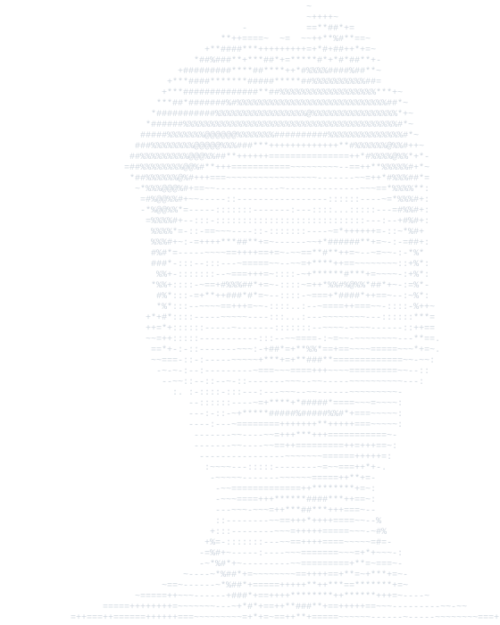

<picture>
  <source media="(prefers-color-scheme: light)" srcset="assets/portrait-light.svg" />
  
</picture>

 

 

## 🧭 &nbsp;About Me

I'm a **software professional** who has walked through many roles — from writing code, leading QA teams, analyzing business requirements, to mentoring engineers and presenting directly to clients and C-level stakeholders.

I don't fit into one box. I connect the dots between **engineering, quality, people, and business**.

 

## 🛠️ &nbsp;What I Bring to the Table

<table>
<tr>
<td align="center" width="25%">

**🔧 Engineering**
  
Java · Spring Boot
 
Kotlin · Android
 
Microservices
 
REST API · SQL

</td>
<td align="center" width="25%">

**🔍 Quality**
  
QA Strategy
 
Test Architecture
 
Automation
 
Performance Testing

</td>
<td align="center" width="25%">

**📋 Analysis**
  
Requirements
 
Process Design
 
Stakeholder Mgmt
 
Documentation

</td>
<td align="center" width="25%">

**🎯 Leadership**
  
Team Mentoring
 
Training & Coaching
 
Client Delivery
 
Technical Talks

</td>
</tr>
</table>

 

## 📌 &nbsp;Featured Project

  

**[QA Engineer Hub](https://xbsvhn.github.io/qa-engineer-hub/)** — A deep knowledge platform for QA Engineers

*From basics to advanced · Understanding essence, not memorizing*

 

A comprehensive, open-source knowledge base built from years of hands-on experience across development, testing, and team leadership. Covering **fundamentals, manual testing, automation, API & performance testing, security, CI/CD, and best practices** — designed for QA professionals who want to go beyond the surface.

 

---

 

*"Ngàn nến có thể được thắp từ một ngọn nến, mà đời ngọn nến ấy không vì thế ngắn đi.*
 
*Hạnh phúc không bao giờ vơi đi khi được chia sẻ."*
 
**— Đức Phật**

 

