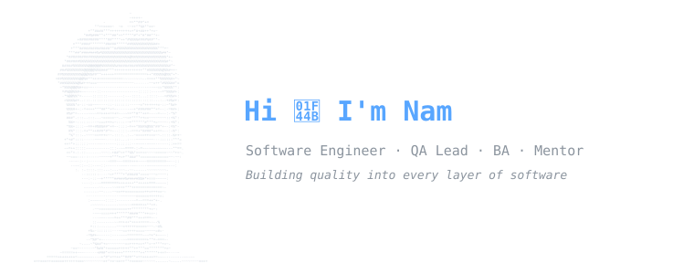

 

 

## 🧭 &nbsp;About Me

I'm a **software professional** who has walked through many roles — from writing code, leading QA teams, analyzing business requirements, to mentoring engineers and presenting directly to clients and C-level stakeholders.

I don't fit into one box. I connect the dots between **engineering, quality, people, and business**.

 

## 🧰 &nbsp;Tech Stack

<picture>
  <source media="(prefers-color-scheme: dark)" srcset="https://skillicons.dev/icons?i=ts,react,nextjs,tailwind,java,spring,kotlin,androidstudio,postgres,redis,docker,git,py&theme=dark" />
  
</picture>

  

+ &nbsp;Apache Kafka &nbsp;·&nbsp; Microservices &nbsp;·&nbsp; REST APIs &nbsp;·&nbsp; WebSocket &nbsp;·&nbsp; JUnit / Vitest &nbsp;·&nbsp; CI/CD

 

## 📌 &nbsp;Featured Project

  

**[QA Engineer Hub](https://xbsvhn.github.io/qa-engineer-hub/)** — A deep knowledge platform for QA Engineers

*From basics to advanced · Understanding essence, not memorizing*

 

A comprehensive, open-source knowledge base built from years of hands-on experience across development, testing, and team leadership. Covering **fundamentals, manual testing, automation, API & performance testing, security, CI/CD, and best practices** — designed for QA professionals who want to go beyond the surface.

 

## 🐍 &nbsp;Contribution Snake

<picture>
  <source media="(prefers-color-scheme: dark)" srcset="https://raw.githubusercontent.com/xbsvhn/xbsvhn/output/github-snake-dark.svg" />
  <source media="(prefers-color-scheme: light)" srcset="https://raw.githubusercontent.com/xbsvhn/xbsvhn/output/github-snake.svg" />
  
</picture>

